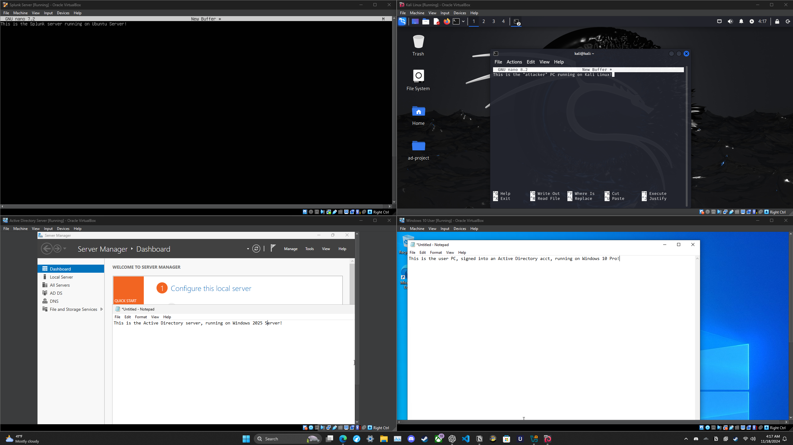

# Active Directory Home Lab

I developed a comprehensive Active Directory environment utilizing Windows Server 2022, a Splunk server running on Ubuntu Server 22.04 LTS, Windows 10 Pro, and Kali Linux virtual machines. The project involved establishing domain configurations, user roles, and security policies to simulate a realistic network infrastructure. Advanced monitoring and logging were implemented using Splunk and Sysmon, while threat simulations—including brute-force RDP attacks using Kali Linux and Atomic Red Team techniques—were conducted to test and analyze security defenses. Through effective incident response strategies, I strengthened network defenses, demonstrating expertise in Active Directory management, network security, threat simulation, and the utilization of security monitoring tools.

  
  
  

---

## Project Outline

### 1. Network Diagram Creation

To effectively organize the project, I began by designing a comprehensive network diagram using [draw.io](https://draw.io). This visual blueprint detailed the connections and interactions between each virtual machine, including IP addresses, operating systems, domain configurations, and the deployment of monitoring tools like Splunk and Sysmon. Mapping the network architecture in advance streamlined system configuration decisions and the strategic placement of security tools, ensuring a cohesive and efficient setup.

---

### 2. Lab Environment Setup & VM Installation

The lab environment was established using **Oracle VirtualBox** for its robustness and flexibility in managing multiple virtual machines. To ensure the integrity of the VirtualBox installation, I verified the download by comparing the software's hash value against Oracle's official checksum.

The setup included deploying:

- **Windows 10 Pro** for the user PC, representing a standard corporate workstation.
- **Kali Linux** as the attacker machine for penetration testing.
- **Windows Server 2022** for Active Directory services.
- **Ubuntu Server 22.04 LTS** for the Splunk SIEM system.

Each VM was meticulously configured with appropriate resources, network interfaces, and the latest operating system updates to ensure optimal performance within the lab environment.

---

### 3. Domain Setup

Establishing a robust domain environment was central to the Active Directory home lab. I configured the Windows Server 2022 VM to host **Active Directory Domain Services**, promoting it to a domain controller with a defined domain name and essential services like DNS. Organizational Units (OUs) were created to logically categorize users and resources, facilitating streamlined management and policy application. Multiple user accounts with varying roles and permissions were established to simulate different access levels, supported by **Group Policy Objects (GPOs)** to enforce security settings and organizational standards.

Integrating the Windows 10 Pro user VM into the domain involved configuring network settings for DNS resolution and verifying domain membership, enabling centralized management and authentication across the lab environment.

---

### 4. Splunk Deployment

Deploying Splunk on an Ubuntu Server provided robust monitoring and logging capabilities within the lab. The installation process involved:

1. Downloading the **Splunk Enterprise** package and installing it using `dpkg`.
2. Configuring the server’s network settings with a static IP address.
3. Adjusting firewall rules to facilitate communication with other VMs.
4. Installing **Splunk Universal Forwarders** on both the Active Directory server and the Windows 10 user VM to collect and securely transmit logs to the Splunk server.
5. Configuring data inputs to ensure reliable log reception.
6. Setting Splunk to run automatically on boot by creating a systemd service.

Connectivity and service stability were verified through comprehensive testing, ensuring that logs were correctly forwarded and indexed, and that Splunk initiated successfully after server reboots.

---

### 5. Brute-Force Attack Simulation with Kali Linux

To evaluate the security of the Active Directory environment, I utilized **Kali Linux** to simulate a brute-force attack targeting the RDP service on the Windows 10 user VM. Using **Crowbar**, a powerful brute-force tool, I configured the attacker VM with the target’s IP address and RDP port, employing a curated list of potential credentials to initiate the attack.

Monitoring system logs on both the attacker and target VMs allowed me to observe the behavior and effectiveness of the brute-force attempts. This simulation exposed vulnerabilities in password policies and authentication mechanisms, highlighting the necessity for strong password requirements and account lockout policies. It also provided practical insights into the detection capabilities of Splunk and Sysmon, demonstrating their effectiveness in identifying and logging unauthorized access attempts.

---

### 6. Network Telemetry and Vulnerability Assessment

Following the brute-force simulation, I focused on analyzing security events and enhancing network defenses using Splunk’s telemetry capabilities. Splunk aggregated logs from the Active Directory server and Windows 10 user VM via Universal Forwarders, while Sysmon provided detailed insights into system activities.

Key actions included:

- Configuring custom dashboards and real-time alerts to monitor key security metrics.
- Implementing advanced correlation searches to identify patterns indicative of security breaches, such as multiple failed login attempts or anomalous user behavior.
- Revising security policies to enforce stricter password requirements and implementing account lockout mechanisms.
- Restricting RDP access to authorized users only.
- Conducting vulnerability assessments using **OpenVAS** on the Kali Linux VM to identify and remediate security weaknesses.
- Performing regular patch management to reduce the attack surface.

This iterative process of monitoring, analysis, and remediation established a resilient security framework, ensuring the network’s defenses remained robust against evolving threats.

---

## Skills and Tools Reinforced

Through the integration of Active Directory, Splunk, and Kali Linux within a controlled lab environment, I demonstrated a comprehensive understanding of:

- **Active Directory Management**: Configuring domains, users, and group policies.
- **Network Security**: Implementing security policies, firewall configurations, and securing network services.
- **Threat Simulation and Penetration Testing**: Using Kali Linux tools to simulate attacks and identify vulnerabilities.
- **Security Monitoring Tools**: Utilizing Splunk and Sysmon for advanced monitoring and logging.
- **Incident Response Strategies**: Analyzing security events and strengthening network defenses through remediation.
- **Vulnerability Assessment**: Employing OpenVAS for scanning and mitigating security weaknesses.
